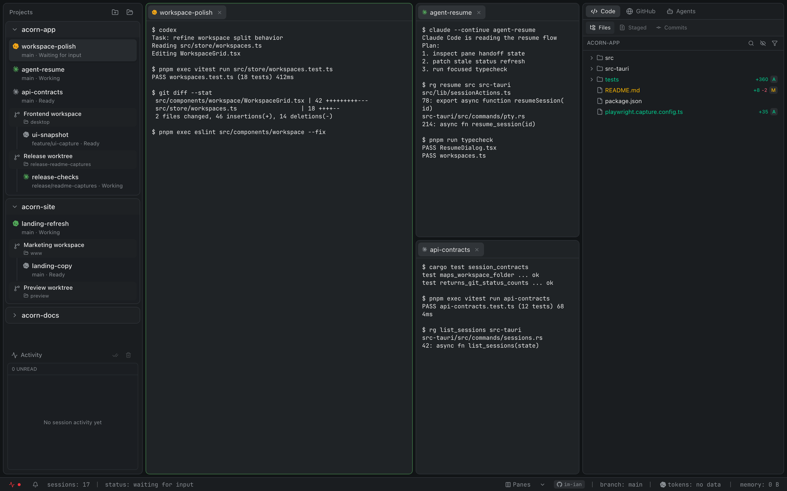
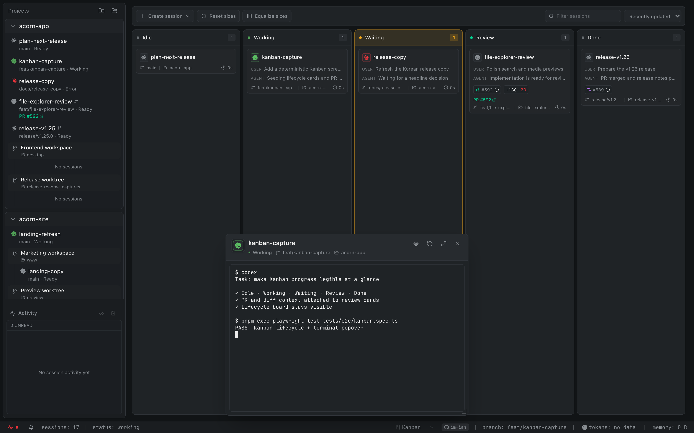
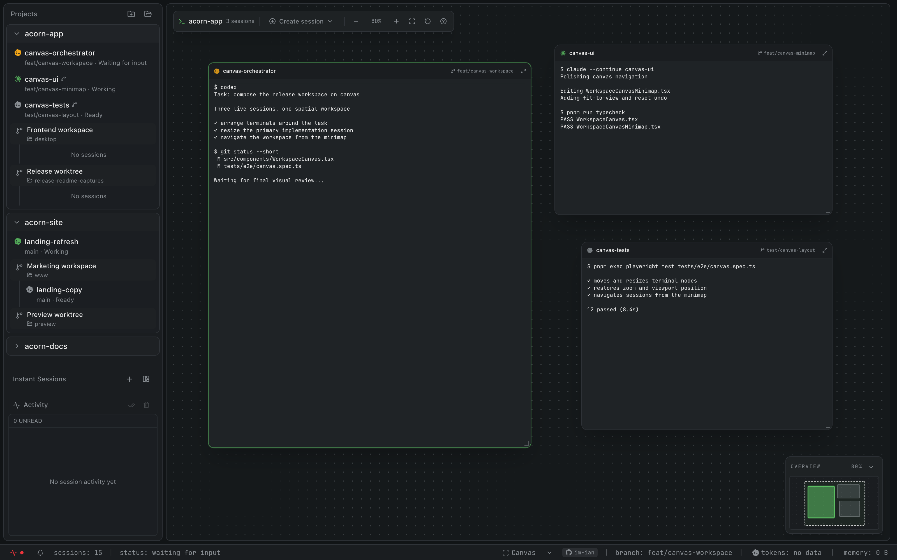
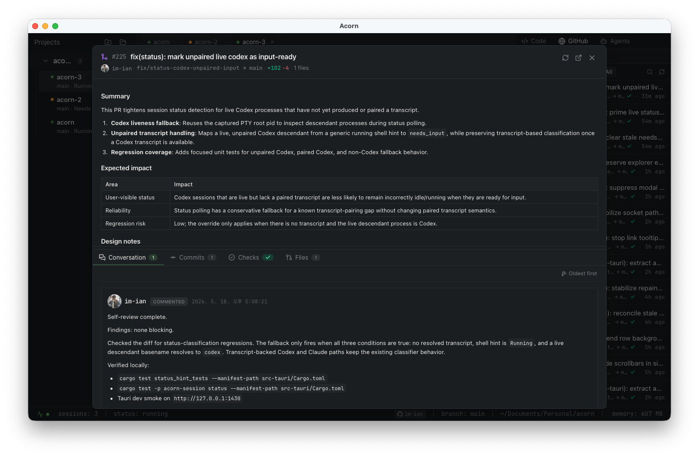
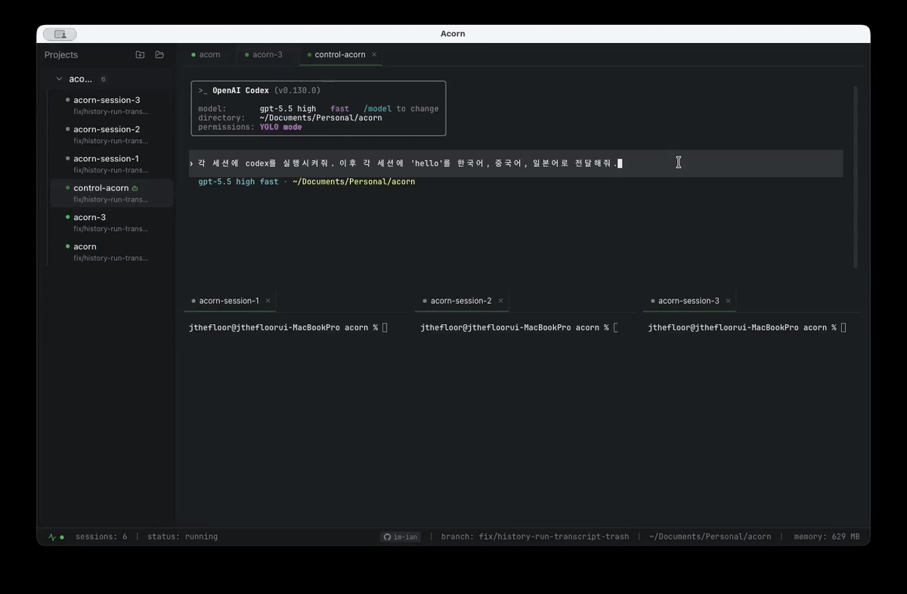

<div align="center">


# Acorn 🌰

**병렬 AI 에이전트 세션을 한 창에서.**
*Parallel AI coding agent sessions in one window — split panes, isolated git worktrees, native PTY terminals.*

AI는 강력하고 똑똑하지만, 결정과 책임은 결국 사람의 몫이죠. Acorn은 AI와 사람이 자연스럽게 협업하기 위해 만들어진 도구입니다.

[](https://tauri.app)
[](https://react.dev)
[](https://www.typescriptlang.org)
[](https://pnpm.io)
[](https://www.rust-lang.org)

<br/>

<a href="https://im-ian.github.io/acorn-web/"><strong>홍보 페이지 보기</strong></a>

</div>

---

## 개요

Acorn은 여러 AI 코딩 에이전트(Claude Code / Codex / Antigravity / Ollama / llm 등) 세션을 한 창에서 병렬로 다루기 위한 데스크톱 앱입니다. 네이티브 PTY와 채팅, 분할 Pane·Kanban·Canvas, 세션별 격리된 git worktree, 작업 요약과 진행 상태 표시를 하나의 워크스페이스에서 제공합니다.

---

## 스크린샷

<div align="center">
  
  <br/>
  <sub>메인 워크스페이스 — 사이드바 + 분할 Pane + 우측 패널</sub>
  <br/><br/>
  
  <br/>
  <sub>Kanban 워크스페이스 — Idle부터 Done까지 세션 lifecycle 추적</sub>
  <br/><br/>
  
  <br/>
  <sub>Canvas 워크스페이스 — 라이브 터미널을 자유롭게 배치하고 한눈에 탐색</sub>
  <br/><br/>
  
  <br/>
  <sub>PR 상세 모달 — 체크 상태 + 변경 사항 + 머지 옵션</sub>
  <br/><br/>
  
  <br/>
  <sub>Control session — `acorn-ipc`로 다른 세션 조작</sub>
</div>

---

## 주요 기능

### 🪟 다중 Pane 워크스페이스
- 가로/세로 분할 + 자유로운 크기 조절
- Pane 간 세션 드래그-드롭, 탭 이동·복제·재배치
- 빈 Pane 더블 클릭으로 새 세션 생성
- 보이는 세션에 같은 입력을 동시에 보내는 multi-input 모드

### 🗂️ Kanban 워크스페이스
- Pane과 Kanban 보기를 프로젝트별로 전환·기억하고 새 프로젝트의 기본 보기 설정
- 세션 상태와 작업 트리 diff, PR 상태를 조합해 **Idle / Working / Waiting / Review / Done**으로 자동 분류
- 세션 검색·정렬, 단계별 체류 시간과 stall 표시, 수동 완료 처리, 열 너비 조절
- 카드에서 터미널·채팅 팝오버 열기, 세션 이름 변경, PR 상세 확인, 새 일반·worktree·chat·control 세션 생성

### 🧭 Canvas 워크스페이스
- 라이브 터미널·채팅 세션을 자유롭게 배치하고 드래그·크기 조절
- 확대·축소, 캔버스 이동, 전체 맞춤, 레이아웃 초기화·실행 취소
- 미니맵으로 멀리 떨어진 세션을 탐색하고 터미널을 팝오버나 Pane으로 전환

### 🌳 프로젝트 + 격리된 git Worktree
- 앱 안에서 새 git 프로젝트 생성 또는 기존 프로젝트 추가
- 프로젝트 안에 이름 있는 워크스페이스를 만들고 사이드바 그룹핑·드래그 재정렬
- 세션마다 별도 worktree로 동일 저장소 안전 동시 작업
- 기존 linked worktree를 워크스페이스로 가져오거나 프로젝트 설정에서 확인·삭제
- 종료 시 worktree 정리 옵션 + 지연 삭제 실행 취소 (항상 삭제 모드 포함)

### 💻 PTY 터미널
- 네이티브 PTY 셸 세션, 재오픈 시 스크롤백 자동 복원
- 터미널 안의 파일 경로 클릭 → 코드 뷰어로 열기
- URL 클릭, 줄 높이, 마지막 사용자 프롬프트 고정 등 동작 옵션

### 🤖 AI 에이전트 세션
- 세션은 항상 `$SHELL`로 시작 — 그 안에서 원하는 AI CLI(`claude` / `codex` / `agy` / `ollama` / `llm` 등) 직접 실행
- Claude / Codex / Antigravity 세션을 현재 Pane이나 새 worktree로 fork
- **에이전트 탭 제목 자동 생성** — 대화 내용에 맞춰 탭 제목 갱신
- 사이드바 라이브 상태 — 유휴 / 입력 대기 / 작업 중 (Claude/Codex/Antigravity transcript + hook 기반)
- 우측 패널 todo 리스트는 **Claude Code 전용** — transcript의 `TodoWrite` 이벤트 파싱

### 💬 네이티브 AI 채팅
- 터미널 명령 없이 Claude / Codex / Antigravity와 대화하는 chat 세션
- 응답 스트리밍·중지, provider 전환, 파일 첨부, 메시지 복사
- 사용자 메시지 수정, 응답 재생성, 이후 대화 가지 삭제
- 원하는 메시지 시점에서 같은 worktree 또는 새 격리 worktree로 대화 fork

### 💾 에이전트 대화 영속화
- `claude` / `codex` / `agy` 대화 UUID를 세션별로 추적해 포커스 시 이전 대화 resume 제안
- 우측 패널 **History** 탭에서 프로젝트별 transcript 히스토리 확인, 더블 클릭으로 새 터미널에서 resume

### 🛏️ Background sessions
- 앱을 종료·재시작해도 **PTY 세션 그대로 유지** — 다시 열면 화면 복원
- 기본 ON. Settings → Services 에서 상태 확인 + Kill / Restore / Forget 제어
- 상태 표시줄 아이콘 드롭다운으로 한눈에 확인

### 🛰️ Control session — 에이전트가 다른 세션 조작
- 한 세션 안의 AI가 같은 프로젝트의 다른 세션을 직접 조작 (입력 전송, 화면 읽기, 새 세션 생성, 선택, 종료)
- 시작: `⌘⌥⇧T` 또는 커맨드 팔레트 → **New control session**
- 자세한 사용법 + 보안 모델: [`docs/CONTROL_SESSIONS.md`](docs/CONTROL_SESSIONS.md)
- 플랫폼: macOS / Linux (Windows 미지원)

### 🎯 우측 패널
세 그룹으로 묶인 탭:

- **Code** — Files / Staged / Commits. 파일 트리·검색·Git 상태, 스테이징 변경, 커밋 + Diff 모달
- **GitHub** — PRs / Issues / Actions. PR 리스트(라벨/체크/CI 시간), Issues 목록/검색/상세 모달, PR 상세 모달(Conversation·Commits·Checks·Files), 이슈·PR 댓글 작성/수정/삭제, 본문 task 토글, 머지 메시지 AI 자동 생성. GitHub Actions 실행 + workflow 필터
- **Agents** — Activity / History / Todos. 세션별 알림, transcript 히스토리, Claude Code todo (`TodoWrite` 이벤트)

### 🔍 File Explorer + Code / Diff / Media 뷰어
- 파일명·내용 검색 (정규식, 대소문자, include/exclude) + dotfile·gitignored 파일 표시 전환
- 파일·폴더 이름 변경, 휴지통 이동, 상대·절대 경로 복사, Finder/기본 프로그램/외부 에디터로 열기
- 파일을 Claude / Codex / Antigravity 대화에 첨부하고 탭 영역으로 드래그해 열기
- 파일 탐색기 또는 터미널의 파일 참조 클릭으로 코드 뷰어 진입
- 신택스 하이라이팅, in-file 검색, markdown source/preview 전환
- Diff 통합 / 분할 모드, 외부 에디터로 열기
- 이미지 확대·축소와 PDF 인앱 미리보기

### 📈 작업 요약
- 세션 메뉴에서 현재 worktree의 변경 파일·라인 증감·상태 분포를 한 탭에 집계
- 변경 파일을 요약에서 바로 열고 세션·브랜치·transcript metadata 확인
- 네이티브 채팅의 메시지·턴 현황과 사용 가능한 경우 입력·출력·캐시·추론 토큰 사용량 표시

### 🛎️ Activity center
- 세션별 알림(입력 대기 / 완료 / 실패)을 우측 패널 Activity 탭과 상태 표시줄에서 모아 보기
- 네이티브 알림 이벤트별 토글, 히스토리 보관 기간 설정

### ⌨️ 커맨드 팔레트 + 단축키
| Action | Shortcut |
| --- | --- |
| 커맨드 팔레트 | `⌘P` |
| 새 세션 / isolated / control | `⌘T` / `⌘⌥T` / `⌘⌥⇧T` |
| 새 프로젝트 | `⌘⇧N` |
| Pane 분할 (세로/가로) | `⌘D` / `⌘⇧D` |
| Pane 크기 균등화 | `⌘⌥E` |
| 탭 닫기 | `⌘W` |
| 사이드바 / 메인 / 우측 패널 포커스 | `⌘1` / `⌘2` / `⌘3` |
| 사이드바 / 우측 패널 토글 | `⌘B` / `⌘J` |
| multi-input 토글 | `⌘⌥I` |
| 다음/이전 세션 | `Ctrl+Tab` / `Ctrl+⇧+Tab` |
| 최근 입력 대기 세션으로 이동 | `Ctrl+⌥]` |
| 터미널 클리어 | `⌘K` |
| 설정 | `⌘,` |

전체 목록은 Settings → Shortcuts 탭에서 확인하고 원하는 조합으로 변경할 수 있습니다.

### 🎛️ 설정
- 언어 / UI 배율 / theme / 배경 이미지 / 기본 Pane·Kanban 보기
- 터미널 폰트 fallback·프리셋, 크기·굵기·자간·줄 높이·안티앨리어싱, 상주 터미널 수
- 단축키 직접 녹화·충돌 감지·개별/전체 초기화
- AI 공급자 선택 (`claude` / `codex` / `antigravity` / `ollama` / `llm` / 커스텀), 외부 에디터 명령
- Background sessions 제어, 작업 중 절전 방지, 종료 경고, orphan worktree·캐시 정리
- macOS 보호 폴더 권한 점검·재설정
- 프로젝트별 PR 생성 설정 (사이드바 프로젝트 → Settings)

### 📊 상태 표시줄 + 자동 업데이트
- 메모리 + 프로세스별 Breakdown, 현재 worktree 브랜치, GitHub 계정 배지
- 활성 Claude / Codex 세션의 토큰 사용량, Background sessions / multi-input 상태 표시
- macOS 자동 업데이트 — 새 버전 감지 시 배너, 적용 시점은 사용자가 선택
- About 탭에서 현재 버전의 GitHub 릴리스 노트 확인

---

## 설치 (macOS)

### 설치 스크립트

```bash
curl -fsSL https://raw.githubusercontent.com/im-ian/acorn/main/scripts/install-macos.sh | bash
```

최신 릴리스 DMG를 내려받아 `/Applications/Acorn.app`에 복사하고 quarantine 속성을 제거합니다. 위치를 바꾸려면 `ACORN_INSTALL_DIR`를 지정:

```bash
curl -fsSL https://raw.githubusercontent.com/im-ian/acorn/main/scripts/install-macos.sh \
  | ACORN_INSTALL_DIR="$HOME/Applications" bash
```

### 수동 DMG

[Releases](https://github.com/im-ian/acorn/releases/latest)에서 `Acorn_*_aarch64.dmg`(Apple Silicon) 또는 `Acorn_*_x64.dmg`(Intel)를 받아 `Applications`로 복사한 뒤 quarantine 속성 제거:

```bash
xattr -dr com.apple.quarantine /Applications/Acorn.app
```

> Acorn은 Apple Developer ID로 서명·공증되지 않은 ad-hoc 빌드입니다. 위 명령은 Gatekeeper의 quarantine 플래그만 떼는 단계로 앱 무결성에는 영향이 없습니다.

---

## 소스에서 빌드

요구사항: **pnpm** 9.x, **Rust** stable, **Xcode CLT** (macOS) 또는 OS 별 Tauri 사전 요구사항.

```bash
pnpm install
pnpm run build:sidecar  # acorn-ipc + acornd 사이드카 빌드 (최초 1회 + IPC/daemon 변경 시)
pnpm run tauri dev      # 개발 모드
pnpm run tauri build    # 프로덕션 빌드
```

> ℹ️ `pnpm run tauri dev` / `tauri build`는 `src-tauri/binaries/acorn-ipc-<target-triple>`, `acornd-<target-triple>` 파일이 존재해야 시작합니다. 이 경로는 `.gitignore`에 포함돼 있어 fresh checkout(특히 `git worktree add`로 만든 worktree)에서는 비어 있고, 미리 빌드하지 않으면 `resource path 'binaries/...' doesn't exist` 에러로 빌드가 실패합니다. `pnpm run build:sidecar`가 호스트 타깃에 맞는 두 바이너리를 빌드하고 올바른 위치에 stage합니다.

개발 모드의 런타임 데이터는 설치된 앱과 분리되어 `~/Library/Application Support/io.im-ian.acorn/profiles/dev/`에 저장됩니다. 프로덕션 빌드는 `profiles/prod/`. 임시 격리가 필요하면 `ACORN_PROFILE=<name>` 또는 `ACORN_DATA_DIR=/tmp/acorn-test`로 앱·IPC CLI·daemon이 볼 데이터 디렉터리를 바꿀 수 있습니다.

### 테스트

```bash
pnpm run test       # Vitest
pnpm run test:e2e   # Playwright
```

기여 가이드는 [`CLAUDE.md`](CLAUDE.md) 참고.

---

## 제작자

🐿️ by [@im-ian](https://github.com/im-ian) — issues / PRs welcome.
