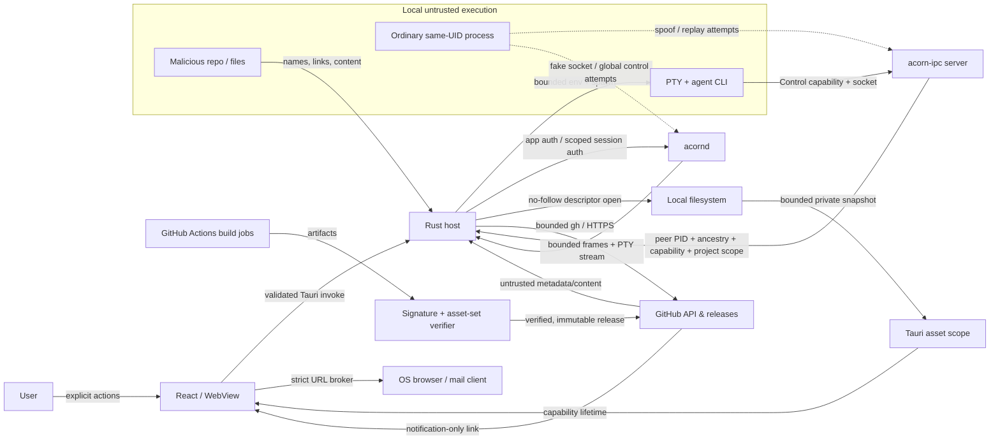

# Acorn Threat Model

검토 기준일: 2026-08-18

## Executive summary

Acorn은 신뢰할 수 없는 Git 저장소와 에이전트 출력을 로컬 PTY, 파일 시스템,
GitHub 자격 증명, OS opener, 릴리스 설치 경로와 연결하는 데스크톱 앱이다. 가장 큰
위험은 저장소/에이전트 프로세스가 Acorn의 로컬 제어 채널을 사칭하는 것, 경로 검사와
실제 open 사이를 바꾸는 것, 자동 AI·업데이터가 사용자 승인보다 넓은 권한으로
실행되는 것이다.

설계는 이제 세션별 capability + kernel peer/ancestry, project-scoped control,
descriptor 기반 파일 snapshot, 공통 bounded process runner, strict external URL broker,
notification-only updater를 기본 경계로 사용한다. OS publisher 인증서가 없고 동일 UID
디버거까지 완전히 차단할 수 없다는 점은 명시적 잔여 위험이다.

## Scope and assumptions

포함 범위:

- Tauri Rust host와 React/WebView renderer 사이 command/event 경계
- `acorn-ipc`, `acornd`, PTY와 에이전트 CLI 프로세스
- 프로젝트·worktree·외부 grant·transcript·state·theme·clipboard·media 파일
- Git/GitHub CLI·API와 원격 Markdown/이미지/URL
- macOS/Windows release artifact, macOS installer, GitHub Actions

가정:

- 사용자가 연 저장소, 파일명, symlink, Git metadata, transcript, agent 출력과 GitHub
  콘텐츠는 악성일 수 있다.
- 같은 OS 사용자로 실행되는 일반 악성 프로세스가 소켓에 연결하고 파일·프로세스를
  관찰하려 시도할 수 있다.
- 공격자는 root/admin/kernel 권한이나 GitHub/OpenAI 자체 인프라 장악 권한은 없다.
- 동일 UID 디버거 attach·메모리 주입이 OS에서 허용되면 앱 자체 capability로 완전한
  기밀성/무결성을 만들 수 없다고 가정한다.
- Apple Developer ID와 Windows Authenticode 인증서는 현재 없다.
- 공식 릴리스 대상은 macOS와 Windows이며 Linux GTK3는 빌드 전이 의존성 검토
  대상으로만 포함한다.

## System model

### Primary components

| 컴포넌트 | 역할 | 신뢰 수준 |
| --- | --- | --- |
| React/WebView renderer | UI, Markdown/media 표시, Tauri command 호출 | 앱 코드 신뢰; 표시 데이터는 비신뢰 |
| Tauri Rust host | 프로젝트/session 권한, 파일·프로세스·OS 기능 broker | 핵심 신뢰 경계 |
| `acorn-ipc` | Acorn Control PTY에서 앱 제어 요청 전송 | capability·peer 검증 후 제한 신뢰 |
| `acornd` | PTY 수명·scrollback·attach를 앱 밖에서 유지 | app auth 또는 session authority로 구분 |
| PTY/agent/AI CLI | Claude/Codex/기타 도구 실행 | 사용자 turn만 권한; 출력·child는 비신뢰 |
| Local filesystem | repo/worktree/transcript/state/theme/media | 경로·내용·링크 모두 비신뢰 가능 |
| GitHub/`gh`/network | PR·issue·release metadata와 artifact | TLS/정확한 origin·schema 확인 전 비신뢰 |
| GitHub Actions release | artifact 생성·서명·게시 | write job만 고신뢰, build artifact는 검증 대상 |
| OS opener/installer | 브라우저·메일·앱 설치 | strict broker/사용자 승인 뒤에만 호출 |

### Data flows and trust boundaries

1. Renderer → Tauri host: invoke payload는 길이·형식·등록 프로젝트 범위를 다시
   검증한다. WebView 자체를 filesystem/command 권한 주체로 보지 않는다.
2. Host → PTY/agent: 제한된 환경만 주입한다. Control session에만 IPC capability를
   부여하고 passive AI에는 모든 `ACORN_*`를 제거한다.
3. PTY → IPC/daemon: socket path/UUID만으로 신뢰하지 않고 kernel peer PID,
   executable, process ancestry, live session, capability, project scope를 결합한다.
4. Filesystem → renderer: descriptor로 연 regular file을 bounded snapshot으로 복사한
   뒤 해당 snapshot만 asset scope에 임시 허용한다.
5. GitHub/remote content → renderer/OS: JSON·body·image 크기와 canonical URL을
   검증하고 OS opener는 HTTP(S)/제한 mailto만 받는다.
6. Release build → publish: immutable commit/tag, pinned action, no mutable package cache,
   artifact signature와 정확한 asset set을 검증한 뒤 게시한다.
7. Update notification → user: 앱은 release metadata만 읽고 공식 페이지를 연다.
   다운로드·설치·재시작은 앱 권한 밖이다.

### Mermaid diagram

## Assets

| Asset | 보안 속성 |
| --- | --- |
| 프로젝트 및 worktree 파일 | 권한 범위, 기밀성, 무결성, symlink 안전성 |
| 사용자 shell/PTY | 명령 무결성, 세션 격리, 가용성 |
| Control session capability | 비밀성, 세션·프로세스·프로젝트 바인딩, 폐기 가능성 |
| Daemon auth token/socket/lock | 단일 인스턴스, endpoint authenticity, 전역 권한 격리 |
| GitHub tokens/계정 | argv·로그·캐시 비노출, 정확한 repo scope |
| Transcript/chat/state/scrollback | bounded parsing, atomicity, lifecycle freshness |
| Theme/clipboard/media snapshot | no-follow, bounded size, 네트워크·스크립트 비실행 |
| Release signing key/artifacts/tag | key secrecy, artifact integrity, immutability, provenance |
| 사용자 화면·로그·terminal output | control/bidi injection 방지, 민감 payload 비노출 |
| 앱 가용성 | frame/file/output/connection/time 예산 |

## Attacker model (capabilities/non-capabilities)

공격자가 할 수 있는 것:

- 악성 저장소와 symlink/hardlink, 긴 파일명·큰 파일·특수 Git object를 제공한다.
- transcript/agent output/Markdown/URL/terminal escape를 생성한다.
- 일반 동일 UID 프로세스로 로컬 소켓을 찾고 연결·재생·가짜 서버를 시도한다.
- Acorn이 실행한 비신뢰 child가 후손 프로세스를 fork하고 pipe를 열어 둔다.
- GitHub 응답·PR/issue body·avatar/image URL·release metadata를 악성 형태로 제공한다.
- CI pull request에서 build input과 저장소 파일을 조작한다.

기본 모델에서 할 수 없다고 보는 것:

- root/admin/kernel 권한 획득, OS trust store 또는 TLS를 깨는 것.
- GitHub Actions/공식 GitHub 도메인 자체를 장악하는 것.
- minisign 서명 키를 탈취하거나 암호학을 깨는 것.
- 인증서가 존재한다고 가정하는 것(현재 존재하지 않음).

경계 밖이지만 중요한 조건:

- 동일 UID에 대한 unrestricted debugger/memory injection은 capability 탈취로 이어질 수
  있다. 이것은 서명·hardened runtime·sandbox 같은 OS 경계 없이는 완전히 막지 못한다.

## Entry points

- 모든 `#[tauri::command]`와 renderer event listener
- local IPC/daemon control·stream sockets와 protocol frames
- PTY stdin/stdout/stderr, hook HTTP endpoint, wrapper spool
- 프로젝트/worktree path, external file grant, drag/drop, clipboard
- transcript/history/marker/ack/state/scrollback/theme/catalog/media/PDF
- Git remote, `gh` CLI, GitHub REST/GraphQL/release JSON, Markdown·avatar·image URL
- updater notification, macOS installer environment variables, release tag/input/artifacts
- shell startup/config 및 SSH config

## Top abuse paths

1. **Repo process → Control session 사칭 → 다른 세션 명령 실행**

   UUID만으로는 부족하고 Control kind, live PTY, kernel peer ancestry, capability,
   project scope를 모두 만족해야 한다. 일반 세션 self-promotion은 불가하다.

2. **가짜 `acornd` socket → 앱의 세션/입력 탈취**

   client는 peer executable을 확인하고 server는 app auth 또는 scoped session auth를
   요구한다. 커널 lock이 중복 daemon을 막는다.

3. **경로 검사 직후 symlink 교체 → 외부 파일 읽기**

   canonical scope 뒤 no-follow descriptor open과 opened metadata를 확인하고, renderer에는
   원본이 아닌 bounded snapshot만 노출한다.

4. **Passive title/commit generation → 저장소 지침을 통한 tool execution**

   tool-free/non-persistent provider만 빈 cwd·stdin·권한 환경 제거 상태로 실행한다.

5. **큰 stdout/file/transcript/frame → 메모리 또는 thread 고갈**

   공통 process/file/frame/connection/depth/line/aggregate 예산과 deadline이 중단한다.

6. **악성 Markdown/URL → `file:`/`javascript:`/userinfo opener 실행**

   renderer 선검사와 Rust strict parser를 모두 통과한 HTTP(S)/제한 mailto만 OS에 넘긴다.

7. **오염된 release cache/artifact → 사용자에게 악성 installer 게시**

   publish job은 package cache를 사용하지 않고 immutable source·정확한 artifact set·서명을
   확인하며 기존 asset 덮어쓰기를 거부한다.

8. **인증서 없는 자동 업데이트 → 서명 키만 가진 공격자의 코드 설치**

   신규 앱은 설치 권한을 제거하고 공식 release 페이지를 여는 notification-only 흐름만
   제공한다. OS publisher identity가 생길 때까지 자동 설치를 재도입하지 않는다.

## Threat table

| ID | 위협 | 자산/경계 | 가능성 | 영향 | 완화 | 잔여 위험 |
| --- | --- | --- | --- | --- | --- | --- |
| TM-001 | IPC 세션 UUID 사칭/승격 | Control capability | 높음(이전) | Critical | protocol v2, one-time capability, Control-only, peer ancestry | debugger 주입 시 탈취 가능 |
| TM-002 | 교차 프로젝트 세션 명령 | 프로젝트/PTY | 중간 | High | source/target project scope, ownership 기본값 | 명시적 Control 정책 오용 |
| TM-003 | 가짜/중복 daemon | socket/state | 중간 | Critical | kernel lock, auth token, peer executable, deadlines | writable unsigned binary 대체 |
| TM-004 | symlink/TOCTOU 파일 탈출 | 로컬 파일 | 높음 | High | canonical scope + no-follow descriptor + snapshot | 동일 UID 직접 파일 권한 |
| TM-005 | 과대 파일/출력/frame DoS | 가용성 | 높음 | High | byte/line/entry/time/connection/process-tree caps | 예산 내 반복 요청 |
| TM-006 | passive AI tool execution | shell/repo/secrets | 중간 | High | tool-free provider allowlist, empty cwd, stdin, strip env | provider CLI 자체 취약점 |
| TM-007 | GitHub slug/OID/argv 주입 | GitHub token/repo | 중간 | High | strict validators, variables, encoding, `--`, no prompt | `gh`/GitHub upstream 취약점 |
| TM-008 | Markdown/URL/CSS 네트워크·스킴 실행 | OS opener/privacy | 높음 | High | safe URL broker, no raw HTML, remote-image consent, CSS scan | 사용자가 승인한 HTTPS origin |
| TM-009 | transcript/hook 상태 위조 | session lifecycle | 높음 | High | token, owner/turn correlation, revision fence, bounded parser | 합법 owner process가 악성인 경우 |
| TM-010 | release cache/artifact 오염 | 배포 사용자 | 중간 | Critical | pinned actions, no cache, immutable tag, signature/asset verification | CI/GitHub 계정 자체 장악 |
| TM-011 | unsigned publisher impersonation | 설치 artifact | 중간 | Critical | notification-only, official URL, minisign, visible warning | OS publisher identity 없음 |
| TM-012 | GTK3 `glib` unsound dependency | Linux build | 낮음(비배포) | High 잠재 | mac/win만 배포, RustSec monitor | Tauri 3/GTK4 전까지 잔존 |
| TM-013 | terminal/log control·bidi 주입 | 사용자 판단/로그 | 높음 | Medium | terminal-safe escaping, bounded labels/errors | raw PTY 자체는 terminal 의미 유지 |
| TM-014 | 사용자 regex UI freeze | renderer availability | 낮음 | Medium | explicit local input, 256자 cap; globs는 linear matcher | regex engine hard deadline 없음 |

## Criticality rationale

- **Critical**은 Acorn이 가진 command execution 또는 release write 권한을 사용자 승인
  없이 획득해 다수 사용자/프로젝트에 코드 실행을 전달할 수 있는 경로다. IPC 승격,
  daemon 전역 제어, release artifact 변조가 여기에 해당한다.
- **High**는 한 사용자/프로젝트에서 파일·PTY·GitHub 권한을 넘거나 지속적인 코드 실행,
  실질적인 메모리/프로세스 고갈을 일으킬 수 있는 경로다.
- **Medium**은 사용자 상호작용이나 공격자에게도 이미 필요한 권한이 있고, 주로 UI
  가용성·표시 무결성에 제한되는 경로다.
- 잔여 위험의 등급은 “현재 악용 가능” 주장과 다르다. 인증서 부재와 GTK3 unsoundness는
  조건이 충족되면 영향이 크므로 낮은 현재 가능성과 별개로 높은 잠재 영향을 유지한다.

## Focus paths

### Same-UID local attacker

가장 중요한 판단은 Unix socket mode나 UUID를 인증으로 취급하지 않는 것이다. 모든
local control 요청은 kernel peer PID → executable → PTY ancestry → live session →
capability → project scope 순으로 좁혀진다. 다만 같은 UID가 합법 Acorn 프로세스에
코드를 주입하거나 메모리를 읽을 수 있으면 이 연쇄의 비밀을 훔칠 수 있으므로,
publisher signing과 hardened OS runtime이 다음 신뢰 경계다.

### Malicious repository and agent output

저장소 문자열은 path, shell, regex, Markdown, URL, CSS, JSONL 어디에서도 구조로 직접
승격되지 않아야 한다. path는 descriptor로, process는 argv/stdin과 bounded runner로,
GitHub 값은 validator/variables/encoding으로, 화면 콘텐츠는 React text/safe component로
처리한다. 자동 AI 작업은 저장소 cwd와 tool registry 자체를 받지 않는다.

### Release without publisher certificates

minisign은 “Acorn release key가 서명한 bytes”를 증명하지만 Apple/Windows가 표시하는
publisher identity와 평판을 제공하지 않는다. 따라서 현 구조는 signature를 publish
전 무결성 검증과 구버전 호환에 사용하고, 신규 앱에서는 다운로드/설치 권한을 제거한다.
공식 GitHub release page 확인과 수동 설치가 현재의 의도된 사용자 승인 지점이다.

### Deferred dependency path

`glib 0.18.5` 경고는 현재 Tauri 2의 Linux GTK3 그래프에 고정돼 있다. 앱 코드에서
임의 patch로 iterator 구현을 덮거나 vendoring하면 장기 유지보수와 ABI 위험이 더 커진다.
Linux 배포를 시작하기 전 Tauri 3/GTK4 전환을 별도 구조 변경으로 수행하고 RustSec,
런타임, 패키징 검증을 다시 통과해야 한다.
